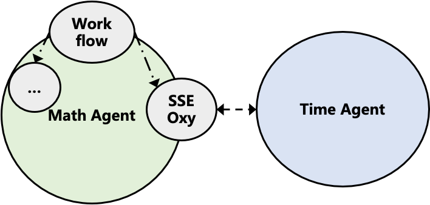

## Introduction

The agent is a basic proxy designed to provide functionality for communicating with remote services. Specifically, different agents interact with remote services through the Server-Sent Events (SSE) protocol. The agent receives an `OxyRequest` object and, after completing the communication task (via the `execute` method), returns an `OxyResponse` object. Below is a detailed explanation of this functionality.

## Quick Start

```python
oxy_space = [
    oxy.HttpLLM(
        name="default_name",
        api_key=get_env_var("DEFAULT_LLM_API_KEY"),
        base_url=get_env_var("DEFAULT_LLM_BASE_URL"),
        model_name=get_env_var("DEFAULT_LLM_MODEL_NAME"),
        llm_params={"temperature": 0.01},
        semaphore=4,
    ),
    oxy.SSEOxyGent(
        name="xxx_agent",
        desc="=======================",
        server_url="http://xxxxxxxxxxx",
        is_share_call_stack=False,
    )
]

async def main():
    async with MAS(oxy_space=oxy_space) as mas:
        result = await mas.call(
            callee="xxx_agent", arguments={"query": "print your question"}
        )
        print(result)

asyncio.run(main())
```
## Complete Example

This example is a `math_agent`, which uses `SSEOxyAgent` to communicate with a `time_agent` to perform mathematical calculation tasks. Below are the illustrations and implementation source code for `math_agent` and `time_agent`. The `math_agent` includes a `workflowAgent`, which can call the `SSEOxyAgent` to communicate with the `time_agent` as part of its steps.

### math_agent
```python
import json

from oxygent import MAS, Config, OxyRequest, oxy
from oxygent.utils.env_utils import get_env_var

Config.set_app_name("app-math")
Config.set_server_port(8081)

with open("config.json", "r") as f:
    config = json.load(f)


async def workflow(oxy_request: OxyRequest):
    short_memory = oxy_request.get_short_memory()
    print("--- History record --- :", short_memory)
    master_short_memory = oxy_request.get_short_memory(master_level=True)
    print("--- History record: User Layer --- :", master_short_memory)
    print("user query:", oxy_request.get_query(master_level=True))
    oxy_response = await oxy_request.call(
        callee="time_agent", arguments={"query": "What time is it now?"}
    )
    print("--- Current time --- :", oxy_response.output)
    import re

    numbers = re.findall(r"\d+", oxy_request.get_query())
    if numbers:
        n = numbers[-1]
        oxy_response = await oxy_request.call(callee="calc_pi", arguments={"prec": n})
        return f"Save {n} positions: {oxy_response.output}"
    else:
        return "Save 2 positions: 3.14, or you could ask me to save how many positions you want."


oxy_space = [
    oxy.HttpLLM(
        name="default_name",
        api_key=get_env_var("DEFAULT_LLM_API_KEY"),
        base_url=get_env_var("DEFAULT_LLM_BASE_URL"),
        model_name=get_env_var("DEFAULT_LLM_MODEL_NAME"),
        llm_params={"temperature": 0.01},
        semaphore=4,
    ),
    oxy.StdioMCPClient(
        name="my_tools",
        params={
            "command": "uv",
            "args": ["--directory", "./mcp_servers", "run", "my_tools.py"],
        },
    ),
    oxy.SSEOxyGent(
        name="time_agent",
        desc="An tool for time query",
        server_url="http://127.0.0.1:8082",
    ),
    oxy.WorkflowAgent(
        name="math_agent",
        desc="An tool for pi query",
        is_master=True,
        sub_agents=["time_agent"],
        tools=["my_tools"],
        func_workflow=workflow,
        llm_model="default_name",
        is_retain_master_short_memory=True,
    ),
]

async def main():
    async with MAS(oxy_space=oxy_space) as mas:
        await mas.start_web_service(first_query="The 30 positions of pi")


if __name__ == "__main__":
    import asyncio
    asyncio.run(main())
```

### time_agent

```python
from oxygent import MAS, Config, oxy
from oxygent.utils.env_utils import get_env_var

Config.set_app_name("app-time")
Config.set_server_port(8082)

oxy_space = [
    oxy.HttpLLM(
        name="default_name",
        api_key=get_env_var("DEFAULT_LLM_API_KEY"),
        base_url=get_env_var("DEFAULT_LLM_BASE_URL"),
        model_name=get_env_var("DEFAULT_LLM_MODEL_NAME"),
        llm_params={"temperature": 0.01},
        semaphore=4,
    ),
    oxy.StdioMCPClient(
        name="time",
        params={
            "command": "uvx",
            "args": ["mcp-server-time", "--local-timezone=Asia/Shanghai"],
        },
    ),
    oxy.ReActAgent(
        name="time_agent",
        desc="A tool for time query",
        is_master=True,
        tools=["time"],
        llm_model="default_name",
        timeout=10,
    ),
]
```

## SSE_Oxy_Agent Principle

### Communication Process

The `sse_oxy_agent` completes the communication function through the following steps:

1. Accept an OxyRequest
2. Construct an SSE request
3. Perform an asynchronous HTTP request
4. Handle different types of data
5. Return an OxyResponse

Firstly, upon receiving an OxyRequest, the agent begins constructing the request body according to the SSE protocol. Specifically, this includes building the URL and setting HTTP headers, where the HTTP headers include `"Accept": "text/event-stream"` and `"Content-Type": "application"`.

Next, the `sse_oxy_agent` uses `aiohttp.ClientSession` to perform an asynchronous HTTP POST request, initiating the asynchronous request. At this point, it reads the SSE stream data line by line. When the received data is "done", the agent logs this and terminates the connection. For other types of data, `sse_oxy_agent` handles them differently: if `data["type"]` is "answer", it extracts the answer content; if it is "tool_call" or "observation", and the caller or callee category is not "user", it processes based on whether to share the call stack and sends messages. For other types of data, the agent directly sends messages.

### is_share_call_stack

In the `SSEOxyGent` class, `is_share_call_stack` is a boolean attribute that controls whether to share call stack information when communicating with remote services. Its specific roles are as follows:

- When this attribute is `True`, it allows sharing call stack information. In this case, the code retains the call stack and the traversed node IDs. This handling method can simplify or protect part of the call path information while retaining enough context for remote services.
- When this attribute is `False`, it indicates not sharing call stack information. At this point, the code deletes the call stack and the traversed node IDs, completely not passing this information. Choosing not to share the call stack may be used to protect privacy or security needs, or to simplify data transmission when call stack information is not needed.

Setting this attribute may depend on specific application scenarios and needs:

- **Debugging and Tracing**: In some scenarios, retaining the call stack can help debug and trace the flow and history of requests.
- **Privacy and Security**: In scenarios involving sensitive information, choosing not to share the call stack may protect privacy.
- **Performance and Simplification**: When call stack information is not needed, removing this information can reduce data transmission volume and improve performance.

### SSE Protocol Explanation

SSE (Server-Sent Events) is a technology for server-to-client one-way real-time data updates, commonly used in web applications needing real-time data updates. SSE is part of the HTML5 specification, providing a way to establish a persistent connection between the browser and server to receive events.

### Relationship between SSEOxyGent and WorkflowAgent

`SSEOxyGent` and `WorkflowAgent` are both agent classes defined in the OxyGent framework, but they have different functions and application scenarios. Below are their relationships and differences:

- **WorkflowAgent**:
  - Inherits from `LocalAgent`, meaning it is mainly used to execute custom workflow functions in a local environment.
  - Focuses on executing user-defined workflow logic, typically running locally or independently of other remote services.

- **SSEOxyGent**:
  - Inherits from `RemoteAgent`, indicating it is used for handling remote service interactions, especially communication through Server-Sent Events (SSE).
  - Primarily used to establish SSE connections with remote servers, receiving and processing event streams.

### Function Comparison

- **WorkflowAgent**:
  - Focuses on executing custom workflow functions.
  - Users can define their business logic through the `func_workflow` attribute.
  - Suitable for scenarios where logic needs to be executed locally.

- **SSEOxyGent**:
  - Focuses on communicating with remote servers via SSE.
  - Supports asynchronous initialization and execution, receiving real-time data or events through SSE.
  - Suitable for scenarios requiring interaction with remote services and handling real-time events.

### Usage Scenarios

- **WorkflowAgent**:
  - Suitable for scenarios requiring flexible integration of custom logic, such as data processing, task automation, etc.
  - Mainly runs in a local environment, not involving direct communication with remote services.
  - `workflowAgent` can integrate different agents to logically execute different tasks.

- **SSEOxyGent**:
  - Suitable for scenarios requiring real-time data updating and processing, such as real-time monitoring, notification systems, etc.
  - Maintains connection with remote servers through SSE, receiving and processing real-time events.

### Summary

`WorkflowAgent` can integrate with `SSE_Oxy_Agent` to complete specific tasks.
